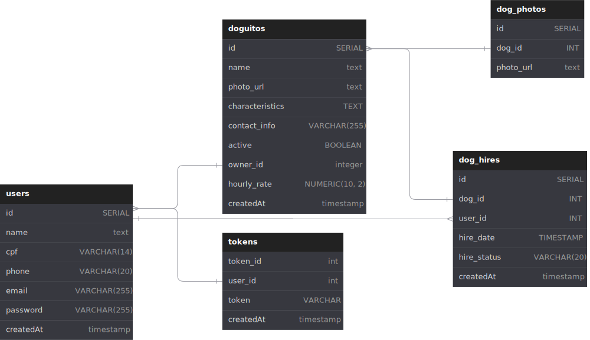

# Weinie: Sua Janela para o Mundo Animal

Bem-vindo à Weinie, a aplicação fullstack que se destaca como uma encantadora vitrine virtual para os nossos queridos amigos peludos! Weinie é muito mais do que apenas uma plataforma - é um espaço dedicado a celebrar a alegria, a beleza e a diversidade dos nossos queridos salsichinhas, unindo tutores apaixonados e proporcionando uma experiência única para compartilhar memórias inesquecíveis.

[Deploy](https://doguitos.onrender.com)

## Tecnologias Utilizadas

A seguir estão as principais tecnologias e bibliotecas utilizadas no desenvolvimento deste projeto:

- **node** (v21.2.0) - A versão do Node.js utilizada no projeto.
- **pg** (v8.11.3) - Um cliente PostgreSQL para Node.js.
- **express** (v4.18.2) - Um framework web para Node.js que facilita a construção de APIs RESTful.
- **cors** (v2.8.5) - Middleware para habilitar CORS (Cross-Origin Resource Sharing) em aplicativos Express.
- **uuid** (v9.0.0) - Uma biblioteca (Universally Unique Identifier) usada como identificador único.
- **dotenv** (v16.3.1) - Carrega variáveis de ambiente a partir de um arquivo `.env`.
- **express-async-errors** (v3.1.1) - Tratamento de erros assíncronos para aplicativos Express.
- **joi** (v17.11.0) - Uma biblioteca para validação de objetos JavaScript.


## Como Executar o Projeto

1. Clone o repositório: 

```bash
  git clone git@github.com:claudiaazambuja/weinie-api.git
```

2. Atualize seu .env com a URL para o banco com base no env.example.
3. Utilize o dump.sql para esquematizar o banco de dados. Exemplo:

```bash
 psql -U seu_usuario -d nome_do_banco -h localhost -f caminho/do/dump.sql
```
4. Instale as dependências: 

```bash
  npm install
```

5. Execute o projeto: 

```bash
  npm start
```

<details>
  <summary><b>⚡ Arquitetura do banco </b></summary>

  
</details>

